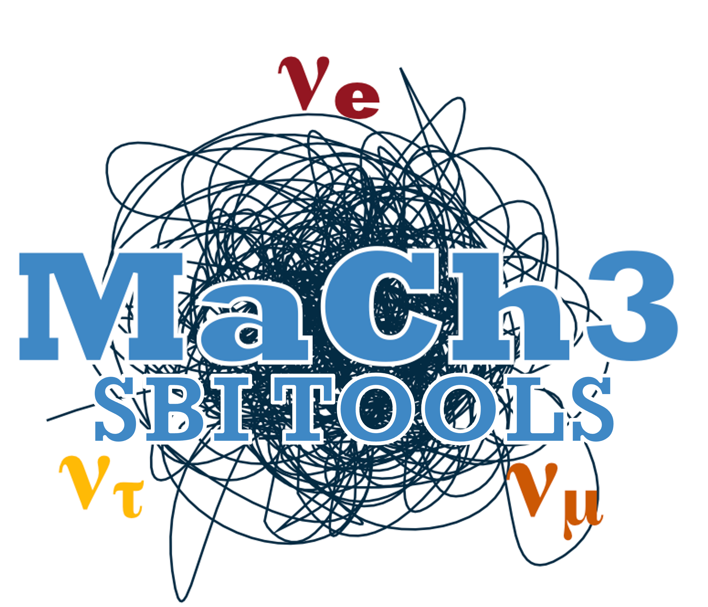

#  `MaCh3 SBI Tools` Simulation Based Inference with Neutrinos

[](https://www.gnu.org/licenses/gpl-3.0)
[](https://codecov.io/github/henry-wallace-phys/mach3sbitools)
[](https://henry-wallace-phys.github.io/MaCh3SbiTools)
[](https://github.com/henry-wallace-phys/MaCh3SbiTools/actions/workflows/pytest.yml)
[](https://github.com/henry-wallace-phys/MaCh3SbiTools/actions/workflows/github-code-scanning/codeql)
[](https://github.com/henry-wallace-phys/MaCh3SbiTools/actions/workflows/mypy.yml)
[](https://github.com/henry-wallace-phys/MaCh3SbiTools/actions/workflows/ruff.yml)
[](https://github.com/henry-wallace-phys/MaCh3SbiTools/actions/workflows/docs.yml)
[](https://github.com/henry-wallace-phys/MaCh3SbiTools/actions/workflows/pymach3_integration.yml)

MaCh3 SBI Tools is a package used to perform
Bayesian Simulation based inference with a flexible simulator and training setup
using tools from the [SBI](https://github.com/sbi-dev/sbi) \[[1](#References)\] package. The simulator
is designed to work primarily with [MaCh3](https://github.com/mach3-software/MaCh3/tree/develop) \[[2](#References)\].

Training is done using [pyTorch Lightning](https://lightning.ai/docs/pytorch/stable/) allowing for the effective use of multiple GPUs.

For full documentation see: https://henry-wallace-phys.github.io/MaCh3SbiTools/

## Install

`mach3sbitools` requires python `3.11` or higher. It can be compiled for usage on a GPU
which requires the appropriate [pyTorch install](https://pytorch.org/get-started/locally/). It is recommended to either use a
`virtual environement`, `uv` or `Conda`.

To get the repo simply clone from github

```shell
git clone git@github.com:henry-wallace-phys/MaCh3SbiTools.git
```

### With PIP

```sh
python -m pip install [-e] .
```

### With UV

```shell
uv pip install .
```

### With Conda

```shell
conda install .
```

## Tutorials

- For install information see the [install guide](https://henry-wallace-phys.github.io/MaCh3SbiTools/modules/getting_started/installation.html)
- For simulator set up information see the [simulator guide](https://henry-wallace-phys.github.io/MaCh3SbiTools/modules/getting_started/building_simulator.html)
- For CLI information see the [cli guide](https://henry-wallace-phys.github.io/MaCh3SbiTools/modules/getting_started/cli.html)
- The full tutorial lives in the [tutorials directory](https://github.com/henry-wallace-phys/MaCh3SbiTools/tree/main/tutorial). The Jupyter notebooks are designed to go from
  physics code all the way your own fully implemented + trained SBI instance

## Pre-Built Simulators

For users of MaCh3 we provide a pre-built simulator for use with pyMaCh3-Tutorial.
It can be found [here](src/mach3sbitools/examples/pyMaCh3). Once pyMaCh3 is installed
the simulator can be used in the CLI through

```shell
mach3sbi [simulate/create_prior/save_data] -m mach3sbitools.examples -c PyMaCh3 pyMaCh3Simulator [opts]
```

This can be adapted for the purposes of your own experimental MaCh3 simply swapping out the `SampleHandler` to
suite your own needs.

More details can be found [here](https://henry-wallace-phys.github.io/MaCh3SbiTools/modules/prebuilt/pymach3.html)

## References

[1] Boelts, J. et al. (2025). sbi reloaded: a toolkit for simulation-based inference workflows.
Journal of Open Source Software, 10(108), 7754. https://doi.org/10.21105/joss.07754

[2] The MaCh3 Collaboration. (2026). mach3-software/MaCh3: v2.4.1 (v2.4.1). Zenodo.
https://doi.org/10.5281/zenodo.18627288
