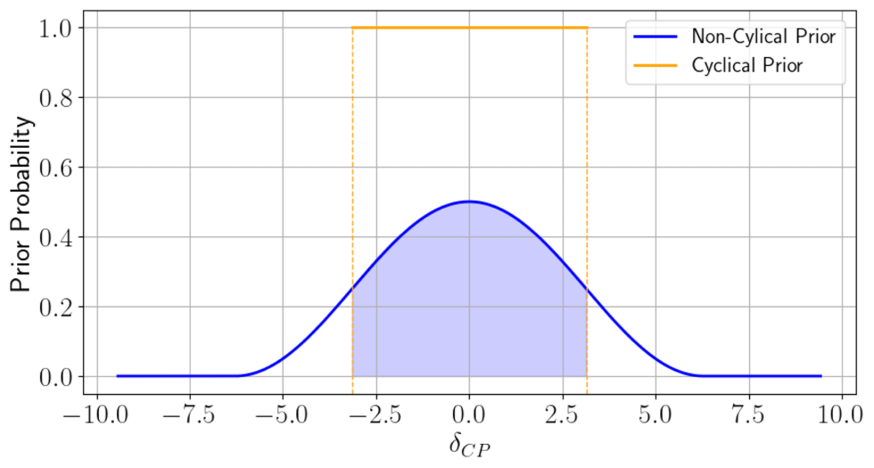

Simulator
=========
MaCh3SBI tools provides utilities for getting priors and simulations directly from a simulator. For a high level overview of how to set up a simulator see  :doc:`getting started <../getting_started/building_simulator>`.

Prior
-----
A set of classes which define a prior. Priors can either be flat (uniform), Gaussian or "cyclical".

.. autoclass:: mach3sbitools.simulator.Prior
   :members:

.. autofunction:: mach3sbitools.simulator.create_prior
.. autofunction:: mach3sbitools.simulator.load_prior

Cyclical Distribution
---------------------
A custom distribution for handling cyclical parameters. This uses a prior of

.. math::

   p(\theta) =
   \begin{cases}
      \frac{1}{2\pi}\sin^{2}\left[\frac{1}{4}(\theta+2\pi) \right] & \mathrm{if}\ \ -2\pi\le \theta\le 2\pi \\
        0 & \mathrm{otherwise}
   \end{cases}

Pictorially, the prior is

This allows the SBI to learn far the distribution better than simply having the distribution cycle at :math:`\pm \pi`. Post-fit this can be wrapped back around to the range :math:`\pm \pi`,

.. autoclass:: mach3sbitools.simulator.priors.cyclical_distribution.CyclicalDistribution
   :members:

Simulator
---------
.. autoclass:: mach3sbitools.simulator.Simulator
   :members:

.. autofunction:: mach3sbitools.simulator.get_simulator

Simulator Protocol
------------------
.. autoclass:: mach3sbitools.simulator.simulator_injector.SimulatorProtocol
   :members:
