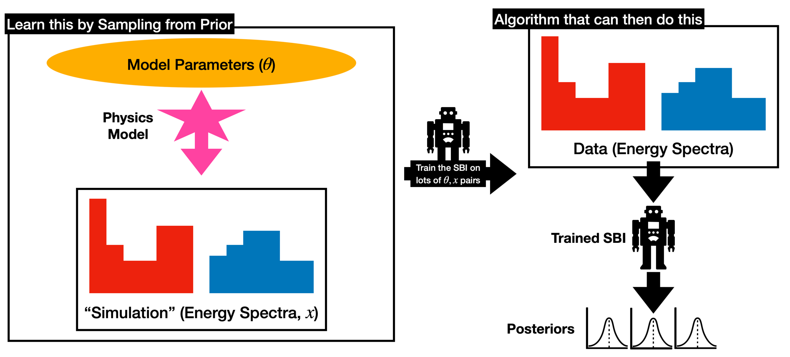

What Is SBI?
====================
Simulation Based Inference (SBI) :cite:`sbi_practical` is a set of techniques that aims to use machine learning to accelerate costly Bayesian analyses using large numbers of simulations. The basic idea is to use machine learning to learn pairs of model inputs and data i.e.

We can then use this model as a surrogate for the real physics model and directly sample from our posterior instead. This can be hugely more efficient.

For a better explanation see: https://sbi.readthedocs.io/en/stable/

Training
-------------
Training is the most costly process for MaCh3SBITools, generating large numbers of simulations is relatively speedy so the main bottleneck is the ~week long training process. This can be monitored through `TensorBoard <https://www.tensorflow.org/tensorboard>`_ which is built into the training loop. Training is much faster on GPUs for most neutrino experiment-sized analyses!